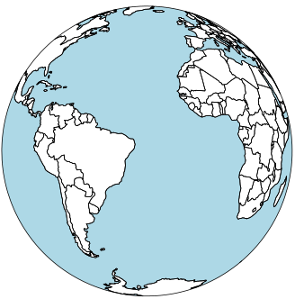

# awesome-maps-r  

- [awesome-maps-r  ](#awesome-maps-r--)
  - [Books](#books)
  - [Datasets](#datasets)
  - [Packages](#packages)
  - [Resources](#resources)
  - [Contribute](#contribute)
  - [License](#license)
  
This repository aggregates helpful resources for creating maps in `R`.

## Books

- [Analyzing US Census Data - Chapter 5 -Census geographic data and applications in R](https://walker-data.com/census-r/census-geographic-data-and-applications-in-r.html)

- [Big Book of R - Chapter 18 - Geospatial](https://www.bigbookofr.com/geospatial)

- [Geocomputation with R](https://r.geocompx.org)

- [ggplot2: Elegant Graphics for Data Analysis (3e)- Chapter 6 - Maps](https://ggplot2-book.org/maps.html)

- [R Graphics Cookbook, 2nd edition](https://r-graphics.org)

- [Spatial Data Science Code With Applications in R](https://r-spatial.org/book/)

## Datasets

- Flanders Marine Institute (2021). Global Oceans and Seas, version 1. Available online at [https://www.marineregions.org/](https://www.marineregions.org/). https://doi.org/10.14284/542

- [USGS - Great Lakes and Watershed Shape Files](https://www.sciencebase.gov/catalog/item/530f8a0ee4b0e7e46bd300dd)

## Packages

- [`ggplot2`](https://ggplot2.tidyverse.org) "is a system for declaratively creating graphics, based on The Grammar of Graphics.

- [`ggspatial`](https://paleolimbot.github.io/ggspatial/) interacts with `ggplot2` as the backend.  Can add scale bars and direction.

- [leaflet](https://rstudio.github.io/leaflet/articles/leaflet.html) "is one of the most popular open-source JavaScript libraries for interactive maps. It’s used by websites ranging from The New York Times and The Washington Post to GitHub and Flickr, as well as GIS specialists like OpenStreetMap, Mapbox, and CartoDB."

- [`ozmaps`](https://mdsumner.github.io/ozmaps/) contains maps of Australia.

- [`rmapshaper`](http://andyteucher.ca/rmapshaper/) can simplify polygons and reduce file sizes.

- [`rmapshaper`](https://github.com/mbloch/mapshaper/)  "is a wrapper around the 'mapshaper' 'JavaScript' library by Matthew Bloch to perform topologically-aware polygon simplification, as well as other operations such as clipping, erasing, dissolving, and converting 'multi-part' to 'single-part' geometries."

- [`rnaturalearth`](https://docs.ropensci.org/rnaturalearth/index.html) "is a public domain map dataset available at 1:10m, 1:50m, and 1:110 million scales. Featuring tightly integrated vector and raster data, with Natural Earth you can make a variety of visually pleasing, well-crafted maps with cartography or GIS software." 

- [`spData`](https://jakubnowosad.com/spData/) is described as "[d]iverse spatial datasets for demonstrating, benchmarking and teaching spatial data analysis. It includes R data of class sf (defined by the package `sf`), Spatial (`sp`), and nb (`spdep`). Unlike other spatial data packages such as         `rnaturalearth` and `maps`, it also contains data stored in a range of file formats including GeoJSON, ESRI Shapefile and GeoPackage."

- [`tigris`](https://github.com/walkerke/tigris) package allows users "to directly download and use TIGER/Line shapefiles from the US Census." Tiger/Line shapefiles contain "current geographic extent and boundaries of both legal and statistical entities (which have no governmental standing) for the United States, the District of Columbia, Puerto Rico, and the Island areas."

- [tmap](https://r-tmap.github.io/tmap/) "is an actively maintained open-source R-library for drawing thematic maps. The API is based on A Layered Grammar of Graphics and resembles the syntax of ggplot2, a popular R-library for drawing charts."

- [`sf`](https://r-spatial.github.io/sf/) package by Edzer Pebesma is the default toolset for working with geographic data in R.

- [`USAboundaries`](https://docs.ropensci.org/USAboundaries/) package "includes contemporary state, county, and Congressional district boundaries, as well as zip code tabulation area centroids. It also includes historical boundaries from 1629 to 2000 for states and counties from the Newberry Library’s Atlas of Historical County Boundaries, as well as historical city population data from Erik Steiner’s “United States Historical City Populations, 1790-2010.” The package has some helper data, including a table of state names, abbreviations, and FIPS codes, and functions and data to get State Plane Coordinate System projections as EPSG codes or PROJ.4 strings."

## Resources

- [EPSG Geodetic Parameter Dataset](https://epsg.org/home.html) "contains definitions of coordinate reference systems and coordinate transformations which may be global, regional, national or local in application."

- [Map Projection Explorer](https://www.geo-projections.com)

-  [Mapshaper](https://mapshaper.org)

- [Projection Wizard](https://projectionwizard.org/#)

- [Proj](https://proj.org/en/9.4/) "supports more than a hundred different map projections and can transform coordinates between datums using all but the most obscure geodetic techniques."

- [R-Charts](https://r-charts.com)

## Contribute

Contributions are always welcome! Please read the contribution [guidelines](./CONTRIBUTIONS.MD) first.

## License

`awesome-maps-r` by Rob Wiederstein is marked with CC0 1.0.  See the [`LICENSE.md`](./LICENSE.MD) for more details.
